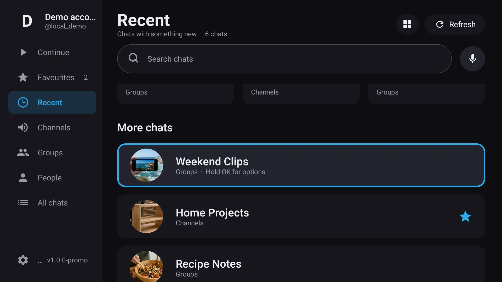
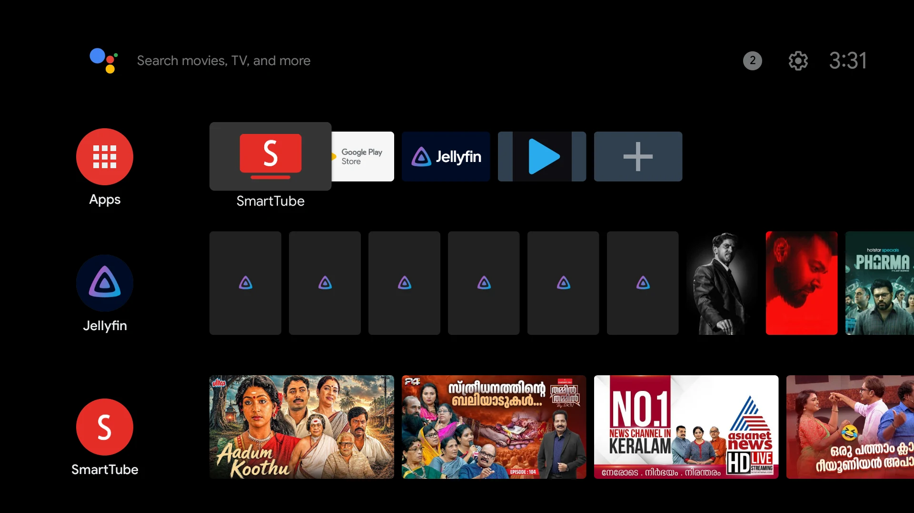

<p align="center">
  
</p>

<h1 align="center">TMPlayer</h1>

<p align="center">Your Telegram films, on the TV. Press play and it starts in seconds.</p>

<p align="center">
  
  
  
</p>

---

You have films sitting in Telegram channels. Watching one on the TV usually means waiting for all
eight gigabytes to land on a phone first, then finding a way to get the file across to the
television and somewhere to keep it.

TMPlayer downloads it too. The difference is that it does not make you wait: scan a QR code with
your phone, pick a film, and it starts playing within seconds while the rest of it arrives behind
the picture. Skip to the ninety-minute mark and it gets there in a few seconds too, because the
download moves to wherever you are instead of grinding through everything before it.

It runs on an 8 GB TV stick with a gigabyte of RAM, because that is what it was built and tested
on.

<p align="center">
  
</p>

## What it does

**Signs in with a QR code.** Open Telegram on your phone, go to Settings → Devices → Link Desktop
Device, point it at the TV. No typing an email address with a D-pad. Two-step verification works,
and a five-page walkthrough on first run says what to press, replayable from Settings.

**Shows films, not messages.** Every chat and channel you are in, listed as poster grids of the
videos inside them. Text messages never appear. Documents are matched by name and type, because
most films arrive as a plain `.mkv` rather than as a video.

**Starts fast and seeks properly.** Playback begins while the file is still arriving, and seeking
re-aims the download rather than waiting for it. This is the whole reason the app exists. Bring the
controls up and the corner says how much of the film has come down, and how quickly.

**Or waits, if your connection would rather.** Settings has a *Download the whole film first*
switch, off by default. On, the film is fetched in full before it starts, which beats being
stopped every few minutes on a line that cannot keep up with playback.

**Handles the formats films actually come in.** MKV, MP4, AVI, TS, and the rest. Embedded
subtitles, including image-based PGS and VobSub. Dual audio tracks you can switch between mid-film.
DTS, TrueHD and E-AC3 decode in software when the stick has no silicon for them, while video stays
on the hardware decoder.

**Tells you what the film is.** Choosing one shows its poster, year, runtime, rating, genres,
synopsis and cast from [The Movie Database](https://www.themoviedb.org), matched from the release
file name, with the trailer a press away. Channel branding, uploader handles and language markers
are stripped off the name before it is looked up, because that is how films actually arrive.

**Knows a series from a film.** A name carrying `S02E04`, `2x04`, `Season 2 Episode 4` or a whole
season is looked up in the television side of the database instead, and the panel shows that
episode's own title, synopsis and still. A **Next** button plays the following episode from the
same chat.

**Remembers where you stopped.** Every film, with a progress bar on its poster. Hold OK on one to
forget it, or clear the whole Continue watching list at once from its heading or from Settings.
Starring a chat keeps it in Favourites, and the chat you last watched from reopens on launch.

**Keeps one film on the device.** An 8 GB stick cannot hold a library. TMPlayer caches the film you
are watching and clears the previous one, telling you exactly how much space that freed. A setting
turns that into a question first, for anyone who would rather be asked.

**Stays out of the way.** Rows or posters, chosen beside the list it rearranges and remembered.
Size limits so a chat full of stickers and clips does not bury the films. A resolution badge on
each tile and nothing else, because the codec was never going to change anyone's mind.

**Finds things by voice.** Press the microphone and say a channel or a file name. It uses the
microphone already in your remote and asks for no permissions to do it.

**Keeps itself current.** It checks GitHub once a launch, puts an amber *Update* on the rail when
there is a newer release, and downloads and installs it for you. Signing out clears everything it
ever kept: the session, your history, favourites, artwork and cached answers.

<p align="center">
  
</p>

## Install it

Grab the APK from [Releases](../../releases) and pick the one matching your device:

| Device | APK |
|---|---|
| Mi TV Stick, most 2018-2021 sticks | `armeabi-v7a` |
| Chromecast with Google TV, newer boxes | `arm64-v8a` |
| Emulators and x86 boxes | `x86_64` |

Not sure which? Run `adb shell getprop ro.product.cpu.abi`.

On the TV, turn on Developer options (Settings → About → press *Build* seven times), enable network
debugging, then:

```bash
adb connect <tv-ip>:5555
adb install TMPlayer-<version>-armeabi-v7a.apk
```

[INSTALL.md](INSTALL.md) covers the sideloading steps in full, along with the remote-control
reference and what to do when something misbehaves.

## What it is not

It hosts nothing, indexes nothing and uploads nothing. There is no server, no bot, and no account
except your own. It shows you media from chats you already joined, and what you do with that is
your responsibility.

It is also not a general Telegram client. You cannot read messages, reply, or send anything. It
plays videos, and that is all it does.

## How it works

[TDLib](https://core.telegram.org/tdlib), Telegram's own client library, handles the account, the
chats and the files, through [tdl-coroutines](https://github.com/g000sha256/tdl-coroutines), which
ships prebuilt natives for every ABI here.

The interesting part is a small [Media3](https://developer.android.com/media/media3) `DataSource`
that maps ExoPlayer's reads onto TDLib's offset-based partial downloads. Seek to a new position and
it points TDLib at that byte instead of waiting for the intervening gigabytes. The window
arithmetic lives in one pure class with the awkward cases pinned down by unit tests, because that
is where a streaming player either works or does not.

The player itself is Media3's leanback integration: the standard Android TV transport controls,
not a hand-rolled imitation of them.

## Build it

You need JDK 17 or newer (21 is what this is built with) and Android SDK platform 36. The app
itself runs on API 26 and up.

Telegram requires every client to identify itself, so you need your own credentials. They are free
and take about two minutes at [my.telegram.org](https://my.telegram.org) → *API development
tools*. Put them in `local.properties` at the repo root:

```properties
sdk.dir=/path/to/Android/Sdk
TG_API_ID=1234567
TG_API_HASH=your_api_hash
TMDB_API_KEY=optional
```

`TMDB_API_KEY` is optional. With it, choosing a film shows a poster, synopsis and cast from
[The Movie Database](https://www.themoviedb.org); without it, that panel says the extras are
unavailable and everything else works unchanged. A key is free at
[themoviedb.org/settings/api](https://www.themoviedb.org/settings/api).

Then:

```bash
./gradlew test              # unit tests
./gradlew assembleDebug     # per-ABI debug APKs
./gradlew assembleRelease   # signed release, needs keystore.properties
```

The build works without credentials; the app just says so on the login screen instead of drawing
a QR code, which is what CI does on every pull request.

## Contributing

[CONTRIBUTING.md](CONTRIBUTING.md) has the details. The short version: keep it small, prefer an
existing library to new code, put logic that can be tested behind a pure function and test it, and
never paste GPL code into an Apache-2.0 project.

Some version constraints in this repo look arbitrary and are not. Each one is documented in
CONTRIBUTING.md with the reason it exists. Please read that before bumping anything.

## Legal

Unofficial client. Not affiliated with, endorsed by, or connected to Telegram FZ-LLC. It uses the
official Telegram API through TDLib with your own credentials, as
[permitted for third-party clients](https://core.telegram.org/api/obtaining_api_id).

Film posters, synopses and cast come from [The Movie Database](https://www.themoviedb.org). This
product uses the TMDB API but is not endorsed or certified by TMDB. Note that TMDB's free tier
covers non-commercial use; shipping this commercially would need a separate agreement with them.

## License

[Apache-2.0](LICENSE) © 2026 dracu-lah

Player mark via [SVG Repo](https://www.svgrepo.com), recoloured.
