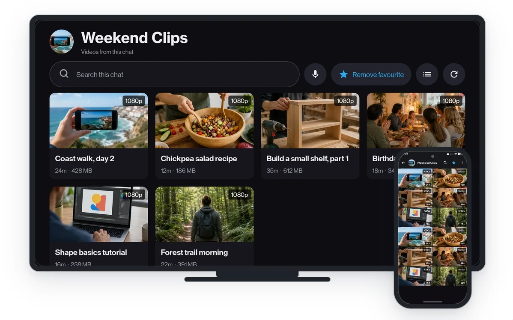

<p align="center">
  
</p>

<h1 align="center">TMPlayer</h1>

<p align="center">Your Telegram videos, on the TV and in your hand. Start watching before the download finishes.</p>

<p align="center">
  
  
  
</p>

---

TMPlayer plays the videos in your own Telegram chats and channels on an Android TV or a phone. It
starts within seconds while the file is still downloading, and seeking re-aims the download instead
of waiting for it.

Sign in by scanning a QR code with your phone, pick a chat, and only its playable videos appear.
No messages, no server, no account except yours.

<p align="center">
  
</p>

<p align="center">
  
</p>

## Runs on

Android 8.0 and up, TV and phone from the same APK. It was built and tested on an 8 GB TV stick
with a gigabyte of RAM, so a cheap device is the target rather than an afterthought.

## Install

Grab the universal APK from [Releases](../../releases). The same file works on every supported
architecture, so there is no CPU variant to identify. Per-architecture APKs are published beside
it and are roughly 40 per cent smaller, if you already know what your device is.

On the TV, turn on Developer options (Settings, About, press *Build* seven times), enable network
debugging, then:

```bash
adb connect <tv-ip>:5555
adb install TMPlayer-<version>-universal.apk
```

[INSTALL.md](INSTALL.md) has the full sideloading steps, the remote-control reference and
troubleshooting.

## Build it yourself

You need JDK 21, Android SDK platform 36, and your own free Telegram credentials from
[my.telegram.org](https://my.telegram.org) in `local.properties`:

```properties
sdk.dir=/path/to/Android/Sdk
TG_API_ID=1234567
TG_API_HASH=your_api_hash
```

[.env.example](.env.example) lists every optional value the build reads, what each one turns on,
and how to set the same ones as repository secrets. All of them are optional: with none of them
present the app builds, runs and carries none of this project's own endpoints, which is what a
fork and every CI run get.

```bash
./gradlew test
./gradlew assembleDebug
```

[docs/BUILDING.md](docs/BUILDING.md) covers release builds, the reference test devices, and the
version pins that are not free choices.

## Read more

- [Feature list](docs/FEATURES.md): everything the app does, and what it deliberately does not.
- [Install guide](INSTALL.md): sideloading, the remote, storage, troubleshooting.
- [Architecture](docs/ARCHITECTURE.md): TDLib, the streaming `DataSource`, why it is built this way.
- [Building](docs/BUILDING.md) and [releasing](docs/RELEASING.md).
- [Contributing](CONTRIBUTING.md): ground rules, style, how to report an issue.
- [Third-party notices](THIRD_PARTY_NOTICES.md): dependency licences and source locations.

## Legal

Unofficial client. Not affiliated with, endorsed by, or connected to Telegram FZ-LLC. It uses the
official Telegram API through TDLib with your own credentials, as
[permitted for third-party clients](https://core.telegram.org/api/obtaining_api_id).

TMPlayer does not provide media, recommend channels, or bypass access controls. Use it only with
content you own or are authorized to access. See the website's [Privacy](https://tmplayer.org/privacy)
and [Lawful use](https://tmplayer.org/legal) pages.

## License

[GNU GPL-3.0](LICENSE) © 2026 dracu-lah

Player mark via [SVG Repo](https://www.svgrepo.com), recoloured.
