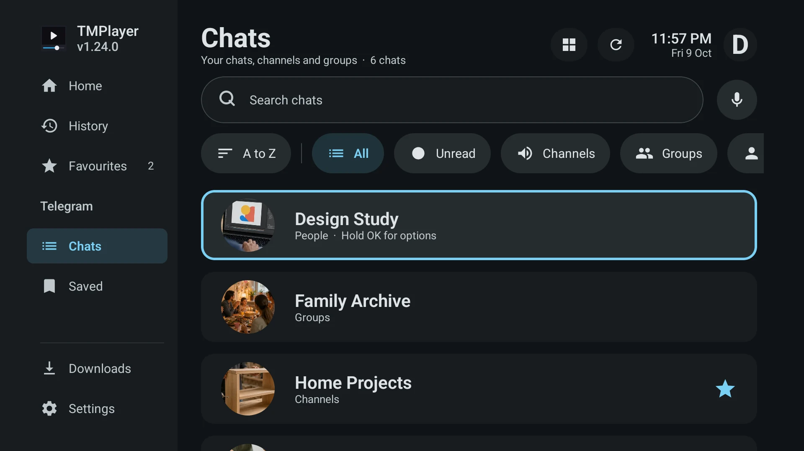
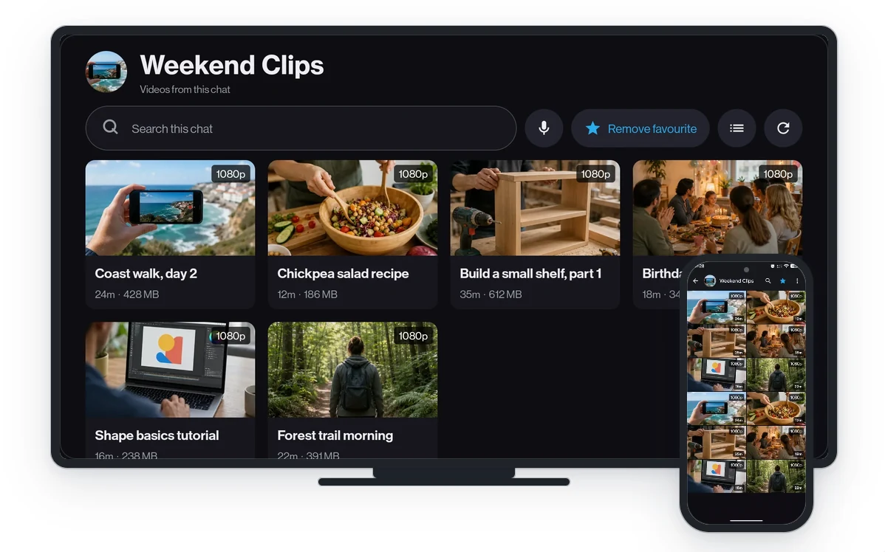

<p align="center">
  
</p>

<h1 align="center">TMPlayer</h1>

<p align="center">Your Telegram videos, on the TV, in your hand and on your computer. Start watching before the download finishes.</p>

<p align="center">
  
  
  
  
</p>

---

TMPlayer plays the videos in your own Telegram chats and channels on an Android TV, a phone, or a
Windows or Linux computer. It starts within seconds while the file is still downloading, and
seeking re-aims the download instead of waiting for it.

Sign in by scanning a QR code with your phone, pick a chat, and only its playable videos appear.
No messages, no server, no account except yours.

<p align="center">
  
</p>

<p align="center">
  
</p>

## Runs on

- **Android 8.0 and up**, TV and phone from the same APK. It was built and tested on an 8 GB TV
  stick with a gigabyte of RAM, so a cheap device is the target rather than an afterthought.
- **Windows 10 and 11**, 64-bit, as an MSI installer or a portable zip.
- **Linux**, 64-bit x86, as a deb, an rpm, an AppImage, a Flatpak or a tarball, with an AUR
  recipe in [desktop/packaging/aur](desktop/packaging/aur).

macOS is planned for later. Everything is on the same [GitHub release](../../releases), and
[tmplayer.org/download](https://tmplayer.org/download/) lists it by platform.

## Install

### Android TV and phones

Grab the universal APK from [Releases](../../releases). The same file works on every supported
architecture, so there is no CPU variant to identify. Per-architecture APKs are published beside
it and are roughly 40 per cent smaller, if you already know what your device is.

On the TV, turn on Developer options (Settings, About, press *Build* seven times), enable network
debugging, then:

```bash
adb connect <tv-ip>:5555
adb install TMPlayer-<version>-universal.apk
```

### Windows

Download `TMPlayer-<version>-windows-x64.msi` and open it. The build is not signed yet, so
SmartScreen says *Windows protected your PC*: click **More info**, then **Run anyway**. It installs
for your user only, with a Start menu entry and a desktop shortcut. The
`-windows-x64-portable.zip` beside it installs nothing: unzip it and run `TMPlayer.exe`.

### Linux

```bash
sudo apt install ./tmplayer_<version>_amd64.deb         # Debian, Ubuntu, Mint
sudo dnf install ./tmplayer-<version>.x86_64.rpm        # Fedora (openSUSE: sudo zypper install --allow-unsigned-rpm)
flatpak install --user ./TMPlayer-<version>.flatpak     # any distribution, needs the Flathub remote
chmod +x TMPlayer-<version>-x86_64.AppImage             # any distribution, then run it
```

Arch: build from [desktop/packaging/aur](desktop/packaging/aur), or use the AppImage or the Flatpak.

[INSTALL.md](INSTALL.md) has the full steps for every platform, how to put the app on the desktop,
in the app menu and on the taskbar, the remote, touch and keyboard references, and troubleshooting.

## Build it yourself

You need JDK 21, Android SDK platform 36, and your own free Telegram credentials from
[my.telegram.org](https://my.telegram.org) in `local.properties`:

```properties
sdk.dir=/path/to/Android/Sdk
TG_API_ID=1234567
TG_API_HASH=your_api_hash
```

[.env.example](.env.example) lists every optional value the build reads, what each one turns on,
and how to set the same ones as repository secrets. All of them are optional: with none of them
present the app builds, runs and carries none of this project's own endpoints, which is what a
fork and every CI run get.

```bash
./gradlew test
./gradlew assembleDebug        # the Android app
./gradlew :desktop:run         # the desktop app, on the computer you are at
```

[docs/BUILDING.md](docs/BUILDING.md) covers release builds, the desktop app and its installers,
the reference test devices, and the version pins that are not free choices.

## Read more

- [Feature list](docs/FEATURES.md): everything the app does, and what it deliberately does not.
- [Install guide](INSTALL.md): sideloading, Windows and Linux, shortcuts, the remote and the keyboard, troubleshooting.
- [Architecture](docs/ARCHITECTURE.md): TDLib, the streaming `DataSource`, why it is built this way.
- [Building](docs/BUILDING.md) and [releasing](docs/RELEASING.md).
- [Contributing](CONTRIBUTING.md): ground rules, style, how to report an issue.
- [Third-party notices](THIRD_PARTY_NOTICES.md): dependency licences and source locations.

## Legal

Unofficial client. Not affiliated with, endorsed by, or connected to Telegram FZ-LLC. It uses the
official Telegram API through TDLib with your own credentials, as
[permitted for third-party clients](https://core.telegram.org/api/obtaining_api_id).

TMPlayer does not provide media, recommend channels, or bypass access controls. Use it only with
content you own or are authorized to access. See the website's [Privacy](https://tmplayer.org/privacy)
and [Lawful use](https://tmplayer.org/legal) pages.

## License

[GNU GPL-3.0](LICENSE) © 2026 dracu-lah

Player mark via [SVG Repo](https://www.svgrepo.com), recoloured.
