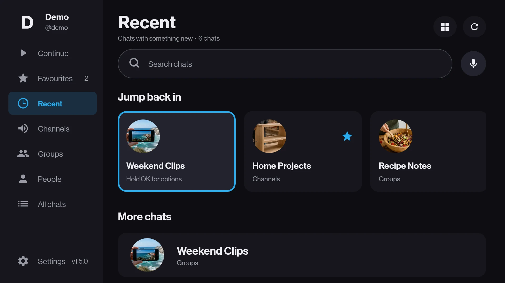
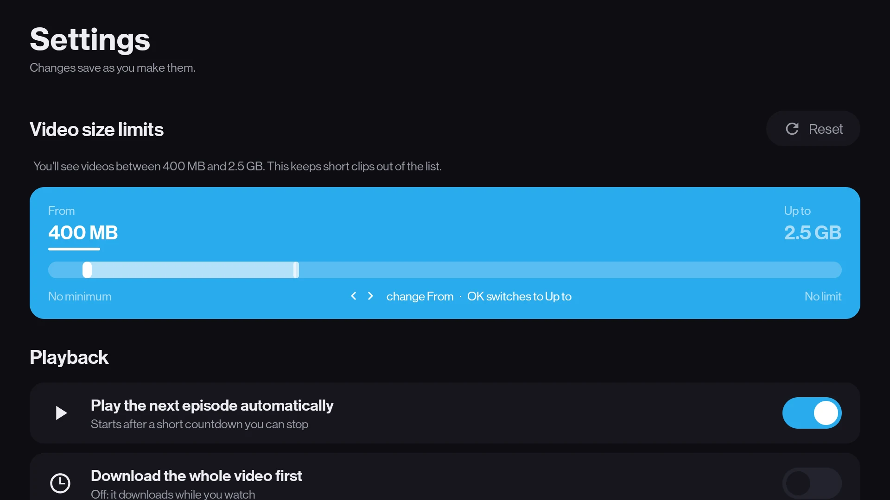
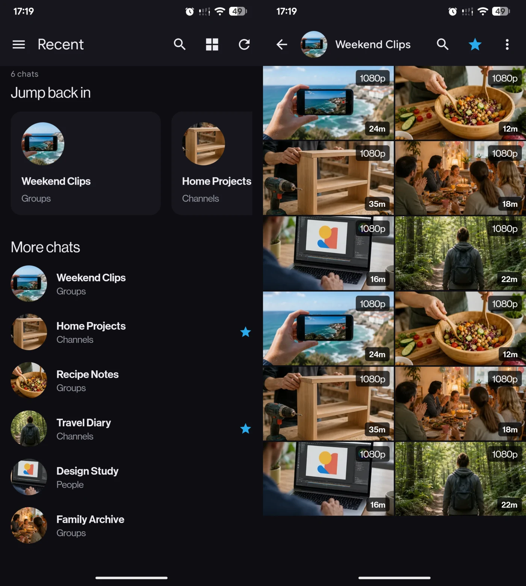

# What TMPlayer does

The long version of the feature list. For installing it, see [INSTALL.md](../INSTALL.md); for how
the streaming works, see [ARCHITECTURE.md](ARCHITECTURE.md).

  

**Signs in with a QR code, or with your number.** On a TV: open Telegram on your phone, go to
Settings, Devices, Link Desktop Device, point it at the screen. No typing an email address with a
D-pad. On a phone the number comes first, with the country picker and the code boxes Telegram
itself uses, and the QR route is there for an account that lives on another handset. Two-step
verification works either way, and a short walkthrough on first run says what to press, replayable
from Settings.

**Shows media, not messages.** Browse the chats and channels you already have, then see only their
playable videos. Text messages never appear. Video documents are included too, so an `.mkv` sent
as a file is not missed.

**Starts fast and seeks properly.** Playback begins while the file is still arriving, and seeking
re-aims the download rather than waiting for it. This is the whole reason the app exists. Bring the
controls up and the corner says how much of the video has arrived, and how quickly.

**Or waits, if your connection would rather.** Settings has a *Download the whole video first*
switch, off by default. On, the video is fetched in full before it starts, which beats being
stopped every few minutes on a line that cannot keep up with playback.

**Handles real-world media files.** MKV, MP4, AVI, TS, and the rest. Embedded subtitles,
including image-based PGS and VobSub, switchable on both a remote and a phone. Multiple audio
tracks you can switch during playback.
DTS, TrueHD and E-AC3 decode in software when the stick has no silicon for them, while video stays
on the hardware decoder.

**Understands episode filenames.** A name carrying `S02E04`, `2x04`, or `Season 2 Episode 4`
is recognized locally. During playback, previous and next controls move between neighbouring
episodes already present in the same chat, on a remote and under a thumb alike, and when one
finishes the next starts on its own after a countdown you can stop. A switch in Settings turns
that off.

**Remembers where you stopped.** Every video gets its own saved position. Hold OK in Continue
watching to forget one, or clear the whole list at once from its heading or from Settings.
Starring a chat keeps it in Favourites, and the chat you last watched from reopens on launch.

**Keeps one video on the device.** An 8 GB stick cannot hold a library. TMPlayer caches the video you
are watching and clears the previous one, telling you exactly how much space that freed. A setting
turns that into a question first, for anyone who would rather be asked. Coming back to a video you
stopped half way through keeps the half already on disk instead of starting the download again, and
backing out of one stops the download rather than leaving it running in the background.

**Is a phone app on a phone.** The same library, drawn the way Android draws things in the hand:
a Material 3 type scale, full-bleed chat rows, search that expands into the app bar, actions as
toolbar icons, real switches and dialogs and sheets, a back arrow on every screen, and a player
that hides the system bars instead of playing underneath them.

**Stays out of the way.** Rows or tiles, chosen beside the list it rearranges and remembered.
Size limits keep a chat full of tiny clips from burying longer videos. A resolution badge on
each tile and nothing else, because the codec was never going to change anyone's mind. A tile
cuts a long filename short, so the whole name sits in the bottom corner of the screen for whatever
the remote is standing on, the way a browser shows the link under the cursor.

**Catches up on demand.** A Refresh button beside every listing, for a video posted while the
screen was open. Nothing is on a timer: a television that re-fetches by itself is a television
that moves what you were about to press. Coming back after the TV has been asleep, the app waits
for Telegram to answer before it says a chat is empty.

**Forgives how you type.** Search is matched word by word rather than as a literal run of
characters, so an accent nobody types, a swapped pair of letters, or one wrong keyword among right
ones still finds the thing. Exact matches still come first.

**Finds things by voice.** Press the microphone and say a channel or a file name. It uses the
microphone already in your remote, or your phone's own dictation, and asks for no permissions to
do it.

**Keeps itself current.** It checks GitHub once a launch, puts an amber *Update* on the rail when
there is a newer release, and downloads and installs it for you. Signing out clears everything it
ever kept: the Telegram session, your history, favourites, settings, and downloaded media.

  

The phone gets its own layout out of the same APK: the chat list, then the chat's videos as tiles.

  

## What it is not

It hosts nothing, indexes nothing and uploads nothing. There is no server, no bot, and no account
except your own. It shows you media from chats you already joined, and what you do with that is
your responsibility.

It is also not a general Telegram client. You cannot read messages, reply, or send anything. It
plays videos, and that is all it does.
