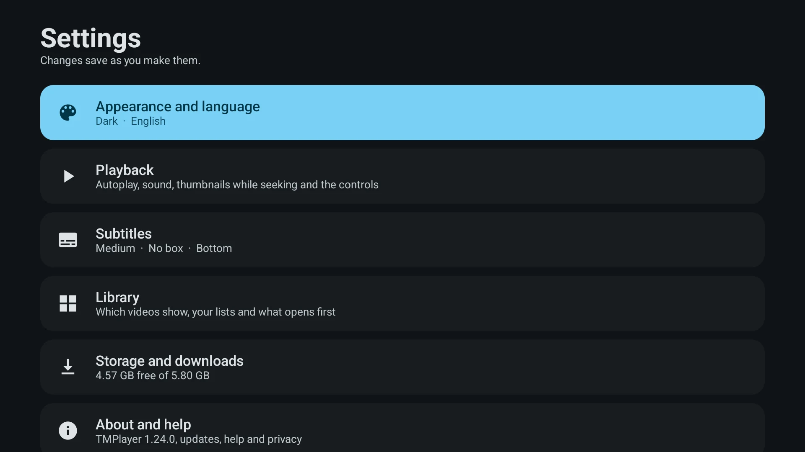
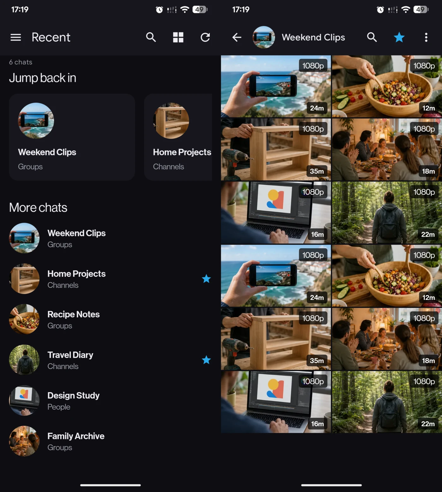

# What TMPlayer does

The long version of the feature list. For installing it, see [INSTALL.md](../INSTALL.md); for how
the streaming works, see [ARCHITECTURE.md](ARCHITECTURE.md).

  

**Signs in with a QR code, or with your number.** On a TV: open Telegram on your phone, go to
Settings, Devices, Link Desktop Device, point it at the screen. No typing an email address with a
D-pad. On a phone the number comes first, with the country picker and the code boxes Telegram
itself uses, and the QR route is there for an account that lives on another handset. Two-step
verification works either way, and a short walkthrough on first run says what to press, replayable
from Settings.

**Shows media, not messages.** Browse the chats and channels you already have, then see only their
playable videos. Text messages never appear. Video documents are included too, so an `.mkv` sent
as a file is not missed.

**Starts fast and seeks properly.** Playback begins while the file is still arriving, and seeking
re-aims the download rather than waiting for it. This is the whole reason the app exists. Bring the
controls up and the corner says how much of the video has arrived, and how quickly.

**Or waits, if your connection would rather.** Settings has a *Download the whole video first*
switch, off by default. On, the video is fetched in full before it starts, which beats being
stopped every few minutes on a line that cannot keep up with playback.

**Handles real-world media files.** MKV, MP4, AVI, TS, and the rest. Embedded subtitles,
including image-based PGS and VobSub, switchable on both a remote and a phone. Multiple audio
tracks you can switch during playback.
DTS, TrueHD and E-AC3 decode in software when the stick has no silicon for them, while video stays
on the hardware decoder.

**Understands episode filenames.** A name carrying `S02E04`, `2x04`, or `Season 2 Episode 4`
is recognized locally. During playback, previous and next controls move between neighbouring
episodes already present in the same chat, on a remote and under a thumb alike, and when one
finishes the next starts on its own after a countdown you can stop. A switch in Settings turns
that off.

**Remembers where you stopped.** Every video gets its own saved position. Hold OK in Continue
watching to forget one, or clear the whole list at once from its heading or from Settings.
Starring a chat keeps it in Favourites, and the chat you last watched from reopens on launch.

**Keeps one video on the device.** An 8 GB stick has no room to keep everything. TMPlayer caches the video you
are watching and clears the previous one, telling you exactly how much space that freed. A setting
turns that into a question first, for anyone who would rather be asked. Coming back to a video you
stopped half way through keeps the half already on disk instead of starting the download again, and
backing out of one stops the download rather than leaving it running in the background.

**Is a phone app on a phone.** The same library, drawn the way Android draws things in the hand:
a Material 3 type scale, full-bleed chat rows, search that expands into the app bar, actions as
toolbar icons, real switches and dialogs and sheets, a back arrow on every screen, and a player
that hides the system bars instead of playing underneath them.

**Plays like a phone player.** A big play and pause in the middle with the jumps and episode
buttons beside it, and every control in reach with the phone held either way. Double tap a side to
jump, and keep tapping to go further; hold to play at 2x; drag for brightness, volume or to travel
through the video, each with its own gauge on screen. Lock the screen against a stray thumb, get a
"Next episode" card in the last half minute, and set how all of it behaves under Settings, Player.

**Stays out of the way.** Rows or tiles, chosen beside the list it rearranges and remembered.
Size limits keep a chat full of tiny clips from burying longer videos. A resolution badge on
each tile and nothing else, because the codec was never going to change anyone's mind. A tile
cuts a long filename short, so the whole name sits in the bottom corner of the screen for whatever
the remote is standing on, the way a browser shows the link under the cursor.

**Catches up on demand.** A Refresh button beside every listing, for a video posted while the
screen was open. Nothing is on a timer: a television that re-fetches by itself is a television
that moves what you were about to press. Coming back after the TV has been asleep, the app waits
for Telegram to answer before it says a chat is empty.

**Forgives how you type.** Search is matched word by word rather than as a literal run of
characters, so an accent nobody types, a swapped pair of letters, or one wrong keyword among right
ones still finds the thing. Exact matches still come first.

**Finds things by voice.** Press the microphone and say a channel or a file name. It uses the
microphone already in your remote, or your phone's own dictation, and asks for no permissions to
do it.

**Keeps itself current.** Shortly after every launch, and every six hours while it runs, it looks
for a newer release, puts an amber *Update* on the rail and in the drawer when there is one, and
offers it once in a popup (Update now, Remind me later, Skip this version). It downloads and
installs it for you, and waits for Wi-Fi when Wi-Fi only is on. Signing out clears everything it
ever kept: the Telegram session, your history, favourites, settings, and downloaded media.

  

The phone gets its own layout out of the same APK: the chat list, then the chat's videos as tiles.

  

## On a computer

A desktop app for **Windows 10 and 11** and **64-bit Linux**, from the same release as the APKs.
macOS is planned for later. It is the same account, the same library and the same streaming, drawn
for a mouse and a keyboard. How to install it is in [INSTALL.md](../INSTALL.md#installing-tmplayer-on-a-computer).

**Signs in the same way.** A QR code fills the window: Telegram on your phone, Settings, Devices,
Link Desktop Device. A phone number and two-step verification work too.

**A sidebar and a grid.** Chats, Favourites, Continue, Downloads and Settings down the side above
a certain width, an icon rail below it. Posters you can make bigger or smaller, a Play button and a
menu when you hover a tile, and a right click menu to play, play from the start, download, remove
a download or copy the Telegram link. `/` or `Ctrl+F` searches, `Ctrl+,` opens Settings, and Esc,
Backspace, Alt+Left and the mouse's back button all go back.

**Plays through mpv.** libmpv and its FFmpeg are bundled, so it opens what the Android app opens,
MKV, MP4, AVI and TS with image subtitles and DTS, TrueHD and E-AC3, without anything installed
beside it. It streams while the file arrives and seeks without waiting, exactly as the television
does, and picks up where you stopped, offers the next episode near the end, and keeps your audio
and subtitle choice for the rest of a series.

**A keyboard you already know.** YouTube's letters, with mpv's and VLC's punctuation as aliases:
Space or K to pause, arrows for 5 seconds and volume, J and L for 10, Shift with an arrow for a
minute, 0 to 9 to jump through the video, F for fullscreen, S and A for subtitles and audio, `]`
and `[` for speed, Shift+N and Shift+P for episodes. A single click pauses, a double click goes
fullscreen, the wheel sets the volume. The whole table is in
[INSTALL.md](../INSTALL.md#using-the-keyboard-and-mouse).

**Behaves like a desktop app.** Keeps the screen awake while a video plays, answers the media keys
(and on Linux the desktop's own media controls, through MPRIS), remembers its window size and
place, and opening it a second time brings the first window forward. Downloads stay on the
computer until you remove them, on their own page.

**Mini player and shortcuts.** Ctrl+P shrinks the window to a small always on top picture in a
corner of the screen and brings it back; `?` lists every key.

**Updates itself.** Shortly after every launch, and every six hours while it runs, it looks for a
newer release; when there is one, an amber *Update* item joins the side bar and a popup offers it
once (Settings can turn the check off). Update now downloads the package that matches the install (MSI,
portable zip, AppImage, deb or rpm), checks it against the release checksums, installs it and
restarts. The deb and rpm ask for your password; the Flatpak and the tarball open the release page.

**What it does not do yet.** No voice search (there is no portable speech API). Windows builds are
not signed yet, so SmartScreen warns the first time.

## What it is not

It hosts nothing, indexes nothing and uploads nothing. There is no server, no bot, and no account
except your own. It shows you media from chats you already joined, and what you do with that is
your responsibility.

It is also not a general Telegram client. You cannot read messages, reply, or send anything. It
plays videos, and that is all it does.
